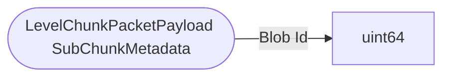

# LevelChunkPacketPayload SubChunkMetadata

`packet`

- protocol: 2168
- minecraft: 1.26.40

```mermaid
flowchart LR
  ROOT(["LevelChunkPacketPayload SubChunkMetadata"])
  ROOT -->|"Blob Id"| uint64["uint64"]
```

