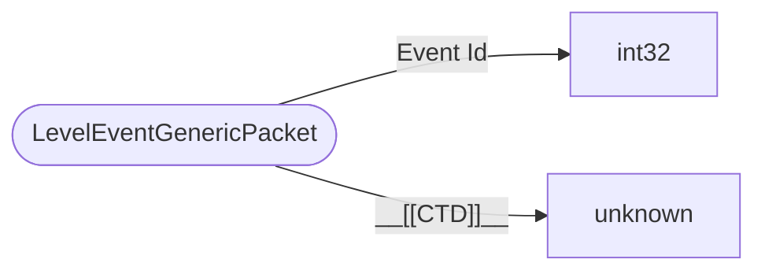

# LevelEventGenericPacket

`packet` - id **124**

```mermaid
flowchart LR
  ROOT(["LevelEventGenericPacket"])
  ROOT -->|"Event Id"| int32["int32"]
  ROOT -->|"__[[CTD]]__"| unknown["unknown"]
```

