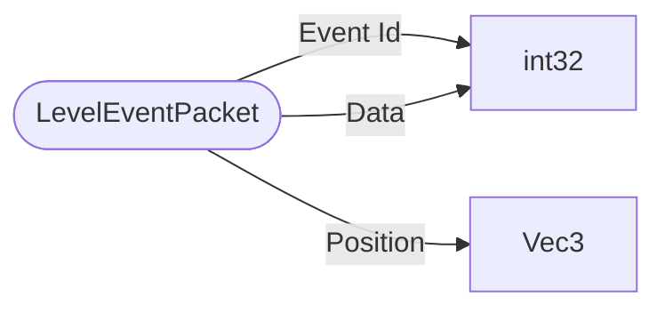

# LevelEventPacket

`packet` - id **25**

- protocol: 2168
- minecraft: 1.26.40

```mermaid
flowchart LR
  ROOT(["LevelEventPacket"])
  ROOT -->|"Event Id"| int32["int32"]
  ROOT -->|"Position"| Vec3["Vec3"]
  ROOT -->|"Data"| int32["int32"]
```

