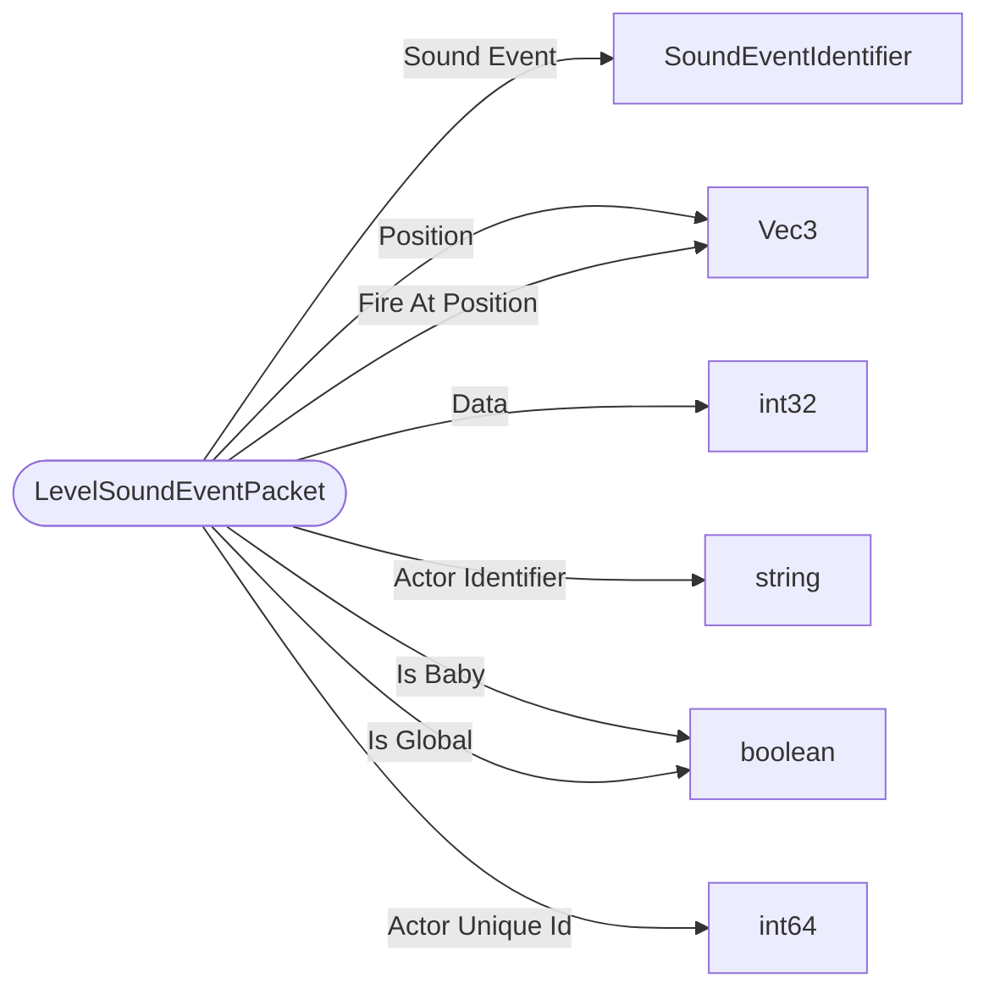

# LevelSoundEventPacket

`packet` - id **123**

	Most sounds get launched on server and replicated to clients, but a handful of player initiated sounds are launched on their client and replicated through the network.
	(In most of the codebase 'Event' means telemetry events; this is not the case here, this is how sounds get replicated across the network in vanilla.)
	With support for custom entities. Entity Id is a string and Event Id is an integer.
	

