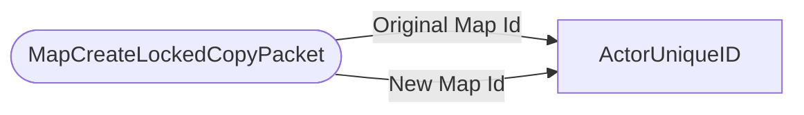

# MapCreateLockedCopyPacket

`packet` - id **131**

	It sends the original map id and the new map id. 
	On the server it follows a similar process to creating a new map, sends the data and the map info to the client.
	

