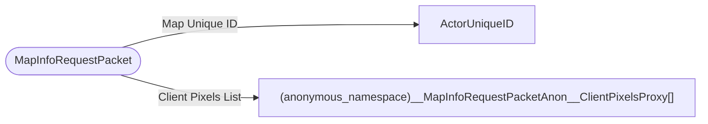

# MapInfoRequestPacket

`packet` - id **68**

- protocol: 2168
- minecraft: 1.26.40

	If the server finds the map, it sends the data back. If it can't find the map, it creates it and sends the map and data back.
	(the map creation data packet and the map data packet are separate packets).
	The response from the server potentially has to load from disk, just an fyi.
	This packet is fired via map item tick, if the map data we have is invalid, or if the map is placed in an item frame.

	For Client Side Generation when we re-sample pixels from the Client's ChunkSource we need to inform the Server's map about
	these new pixels so that it can save them to LevelStorage. Use this packet to send to the Server the extra pixels
	

