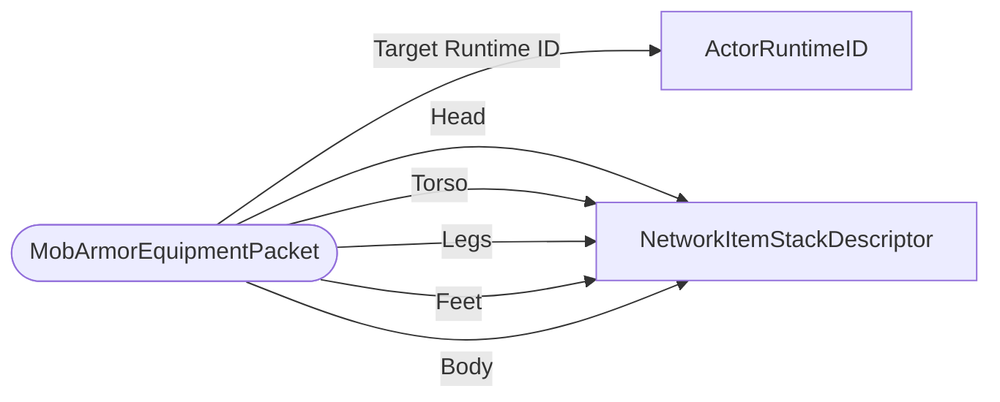

# MobArmorEquipmentPacket

`packet` - id **32**

This is related to MobEquipmentPackets, but armor specifically and passes ALL equipment changes at once instead of one slot at a time.

```mermaid
flowchart LR
  ROOT(["MobArmorEquipmentPacket"])
  ROOT -->|"Target Runtime ID"| ActorRuntimeID["ActorRuntimeID"]
  ROOT -->|"Head"| NetworkItemStackDescriptor["NetworkItemStackDescriptor"]
  ROOT -->|"Torso"| NetworkItemStackDescriptor["NetworkItemStackDescriptor"]
  ROOT -->|"Legs"| NetworkItemStackDescriptor["NetworkItemStackDescriptor"]
  ROOT -->|"Feet"| NetworkItemStackDescriptor["NetworkItemStackDescriptor"]
  ROOT -->|"Body"| NetworkItemStackDescriptor["NetworkItemStackDescriptor"]
```

