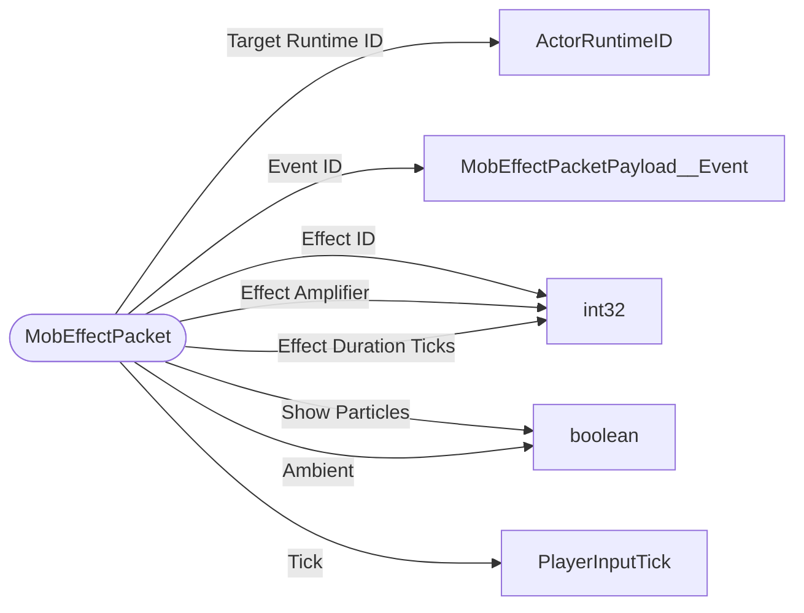

# MobEffectPacket

`packet` - id **28**

At the start of the game the server sends any mob effects with _sendAdditionalLevelData() if the joining player saved out with them,
and then anytime a mob effect is added, removed, or updated this packet is sent. 
It is important for player movement simulation to ensure that the following effects are sent for the player or any client predicted vehicle they are in control of: 
- levitation 
- slow_falling 
- jump 
- movement_speed 
- movement_slowdown 
- weaving

