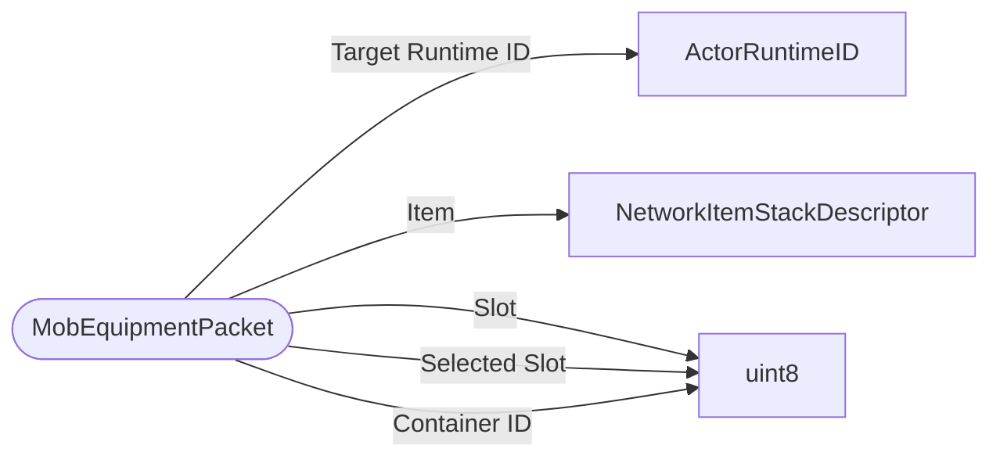

# MobEquipmentPacket

`packet` - id **31**

```mermaid
flowchart LR
  ROOT(["MobEquipmentPacket"])
  ROOT -->|"Target Runtime ID"| ActorRuntimeID["ActorRuntimeID"]
  ROOT -->|"Item"| NetworkItemStackDescriptor["NetworkItemStackDescriptor"]
  ROOT -->|"Slot"| uint8["uint8"]
  ROOT -->|"Selected Slot"| uint8["uint8"]
  ROOT -->|"Container ID"| uint8["uint8"]
```

