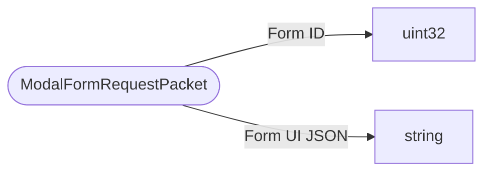

# ModalFormRequestPacket

`packet` - id **100**

- protocol: 2168
- minecraft: 1.26.40

Not sent from vanilla. The feature is meant for third-party servers to be able to drive dynamic ui forms. The request comes with some JSON that describes a custom UI screen thirdparty uses.Server->client.

