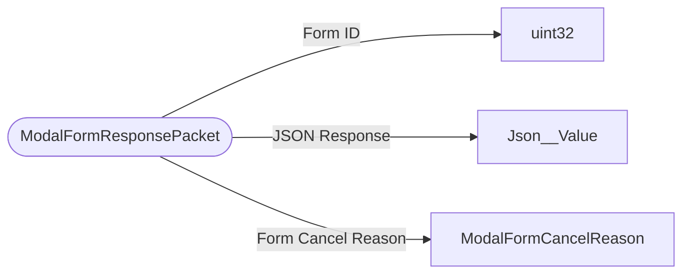

# ModalFormResponsePacket

`packet` - id **101**

- protocol: 2168
- minecraft: 1.26.40

see ModalFormRequestPacket

```mermaid
flowchart LR
  ROOT(["ModalFormResponsePacket"])
  ROOT -->|"Form ID"| uint32["uint32"]
  ROOT -->|"JSON Response"| Json__Value["Json__Value"]
  ROOT -->|"Form Cancel Reason"| ModalFormCancelReason["ModalFormCancelReason"]
```

