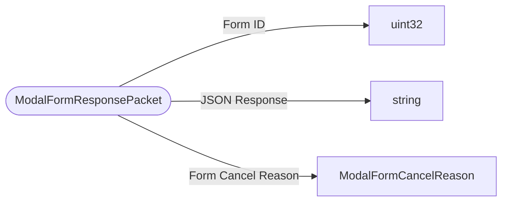

# ModalFormResponsePacket

`packet` - id **101**

see ModalFormRequestPacket

```mermaid
flowchart LR
  ROOT(["ModalFormResponsePacket"])
  ROOT -->|"Form ID"| uint32["uint32"]
  ROOT -->|"JSON Response"| string["string"]
  ROOT -->|"Form Cancel Reason"| ModalFormCancelReason["ModalFormCancelReason"]
```

