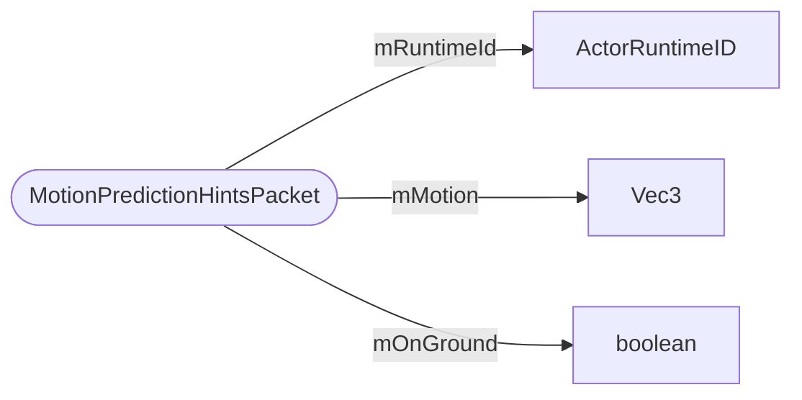

# MotionPredictionHintsPacket

`packet` - id **157**

This is from the server when spatial optimizations are enabled and the server does not send a spatial update.

```mermaid
flowchart LR
  ROOT(["MotionPredictionHintsPacket"])
  ROOT -->|"mRuntimeId"| ActorRuntimeID["ActorRuntimeID"]
  ROOT -->|"mMotion"| Vec3["Vec3"]
  ROOT -->|"mOnGround"| boolean["boolean"]
```

