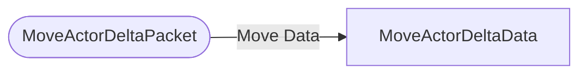

# MoveActorDeltaPacket

`packet` - id **111**

Each position, rotation and head-rotation component is sent as an independent optional, accompanied by flags indicating whether the actor is on the ground and whether this is a teleport.

