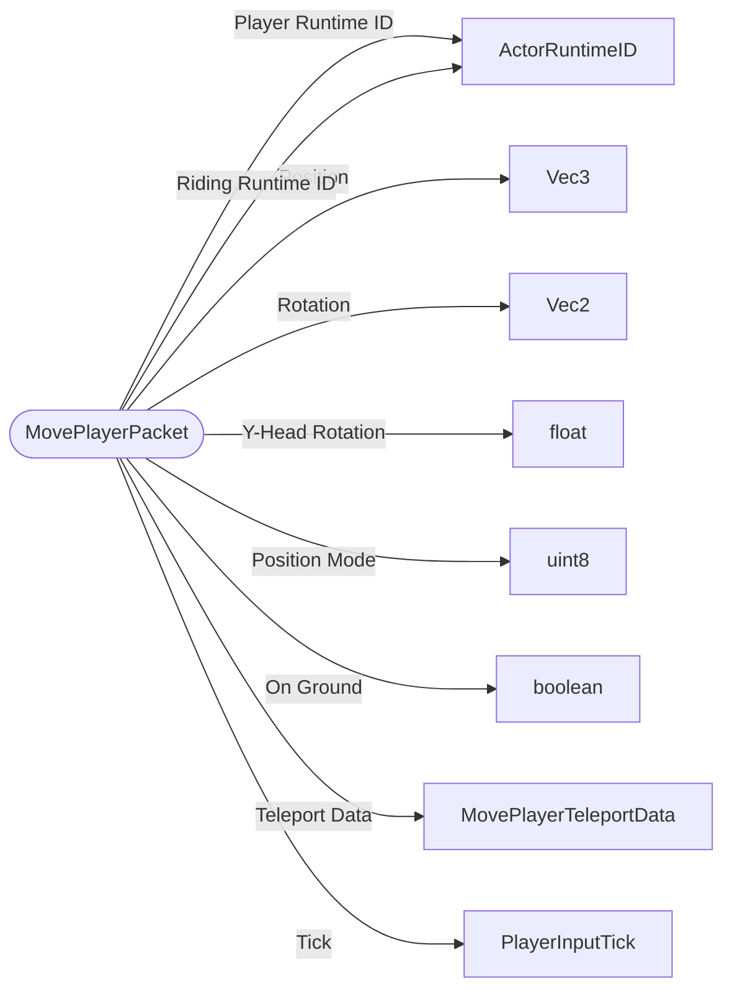

# MovePlayerPacket

`packet` - id **19**

- protocol: 2168
- minecraft: 1.26.40

```mermaid
flowchart LR
  ROOT(["MovePlayerPacket"])
  ROOT -->|"Player Runtime ID"| ActorRuntimeID["ActorRuntimeID"]
  ROOT -->|"Position"| Vec3["Vec3"]
  ROOT -->|"Rotation"| Vec2["Vec2"]
  ROOT -->|"Y-Head Rotation"| float["float"]
  ROOT -->|"Position Mode"| uint8["uint8"]
  ROOT -->|"On Ground"| boolean["boolean"]
  ROOT -->|"Riding Runtime ID"| ActorRuntimeID["ActorRuntimeID"]
  ROOT -->|"Teleport Data"| MovePlayerTeleportData["MovePlayerTeleportData"]
  ROOT -->|"Tick"| PlayerInputTick["PlayerInputTick"]
```

