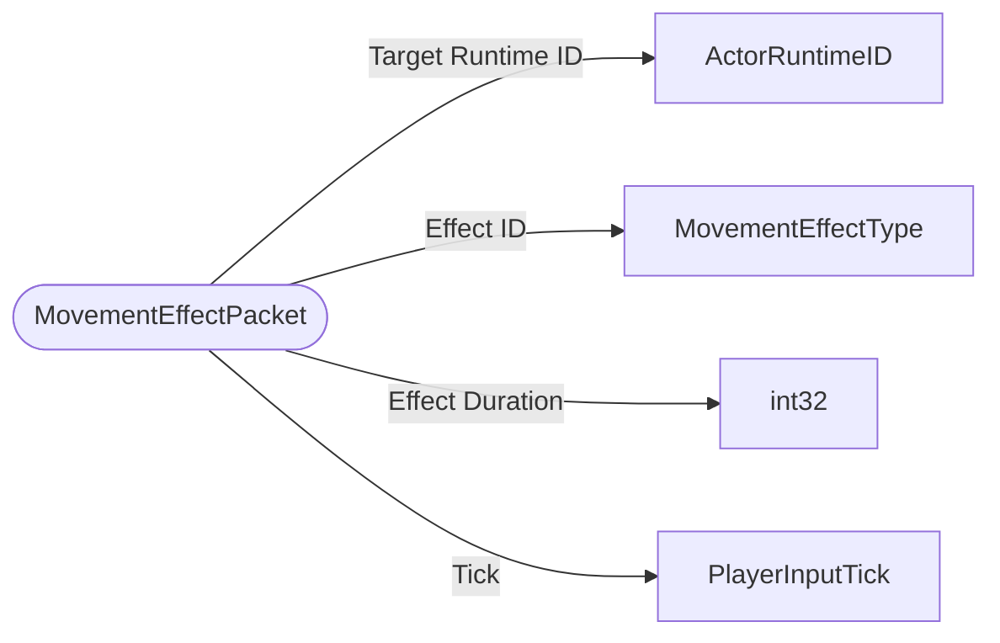

# MovementEffectPacket

`packet` - id **318**

- protocol: 2168
- minecraft: 1.26.40

	These MovementEffects can be client-predicted.
	Ex: Fireworks Rockets used while gliding send this packet to the client so they know the exact duration of the GLIDE_BOOST MovementEffect.
	

