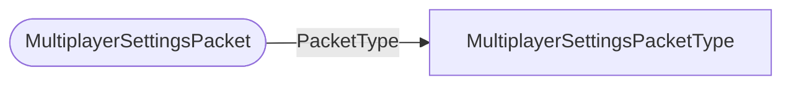

# MultiplayerSettingsPacket

`packet` - id **139**

	This is used by EDU for joining players and removing players from your session,
	the settings (there is only one) is an enum for enabling/disabling/refreshing multiplayer join codes.
	Starts on the client, and a response to the client is issued from the server.
	

