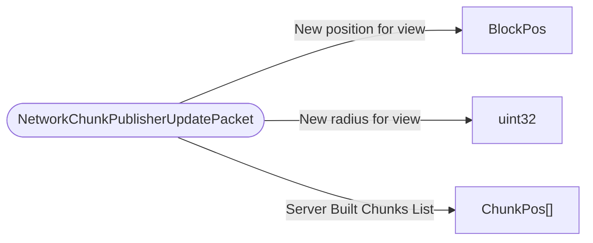

# NetworkChunkPublisherUpdatePacket

`packet` - id **121**

Used (from the server) when a user's Chunk View moves, I.e. the area that determines what chunks exist. For ClientSideGeneration we also send the client a list of ChunkPos that the Server will fully build.

