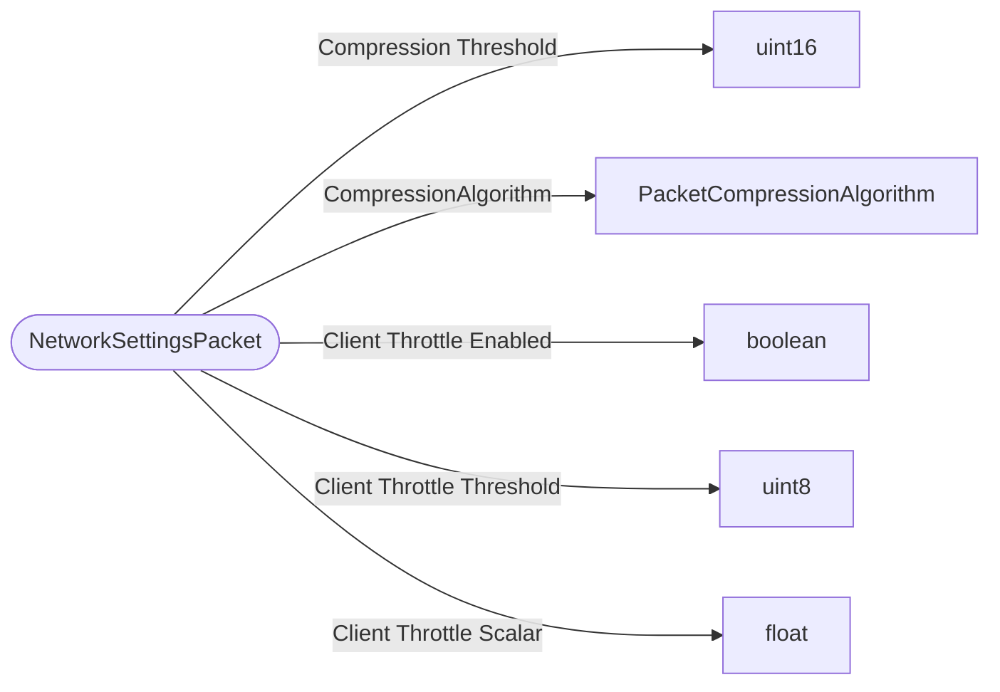

# NetworkSettingsPacket

`packet` - id **143**

```mermaid
flowchart LR
  ROOT(["NetworkSettingsPacket"])
  ROOT -->|"Compression Threshold"| uint16["uint16"]
  ROOT -->|"CompressionAlgorithm"| PacketCompressionAlgorithm["PacketCompressionAlgorithm"]
  ROOT -->|"Client Throttle Enabled"| boolean["boolean"]
  ROOT -->|"Client Throttle Threshold"| uint8["uint8"]
  ROOT -->|"Client Throttle Scalar"| float["float"]
```

