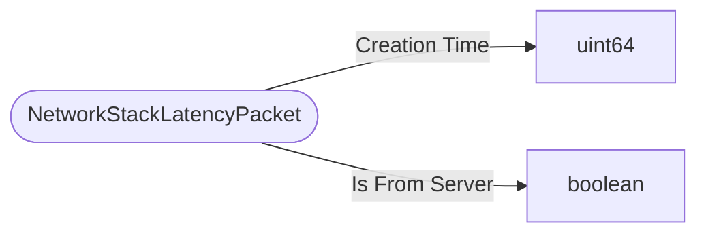

# NetworkStackLatencyPacket

`packet` - id **115**

- protocol: 2168
- minecraft: 1.26.40

DEPRECATED. Was for testing/debug/telemetry: Used to provide ping time to in game debug graph, also for realms telemetry of actual in game latency.  Sent from both client & server.

