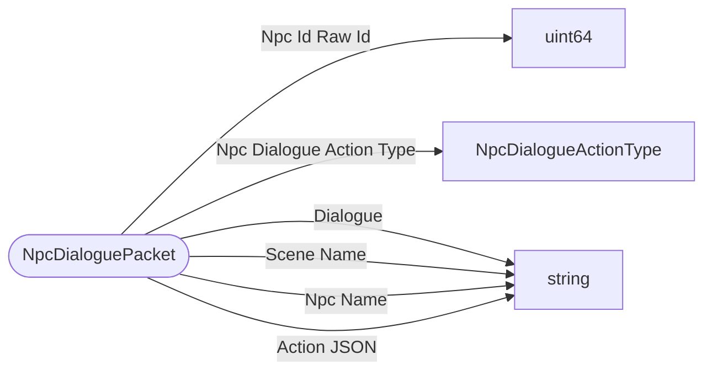

# NpcDialoguePacket

`packet` - id **169**

- protocol: 2168
- minecraft: 1.26.40

```mermaid
flowchart LR
  ROOT(["NpcDialoguePacket"])
  ROOT -->|"Npc Id Raw Id"| uint64["uint64"]
  ROOT -->|"Npc Dialogue Action Type"| NpcDialogueActionType["NpcDialogueActionType"]
  ROOT -->|"Dialogue"| string["string"]
  ROOT -->|"Scene Name"| string["string"]
  ROOT -->|"Npc Name"| string["string"]
  ROOT -->|"Action JSON"| string["string"]
```

