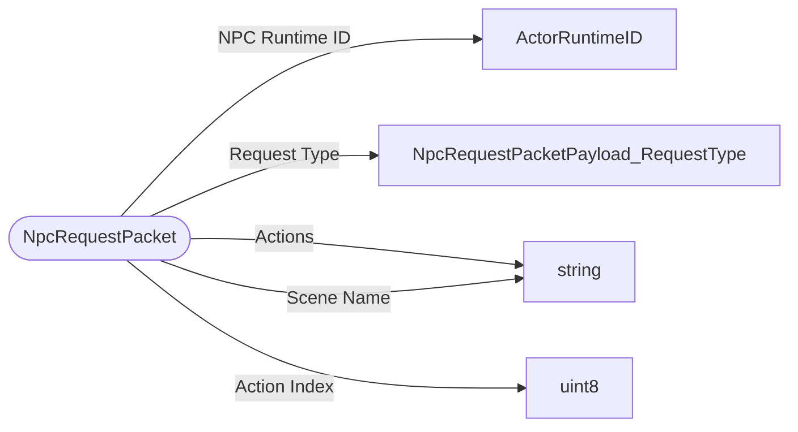

# NpcRequestPacket

`packet` - id **98**

A request is made from the client during an interaction with an NPC then the request is processed by the server. 
	Actor MUST have the NPCComponent to be handled. 
	We currently only use this for EDU, but the goal was to expose the NPC Component to creators.

