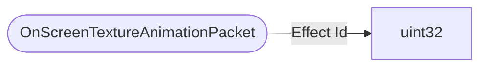

# OnScreenTextureAnimationPacket

`packet` - id **130**

Sent from the player (and in one case from the village) to make those really cool animated effects for the hero of the village and the totem saving you. Just an id (unsigned int). At least thats what the code suggests. May be obsolete / deprecated.

