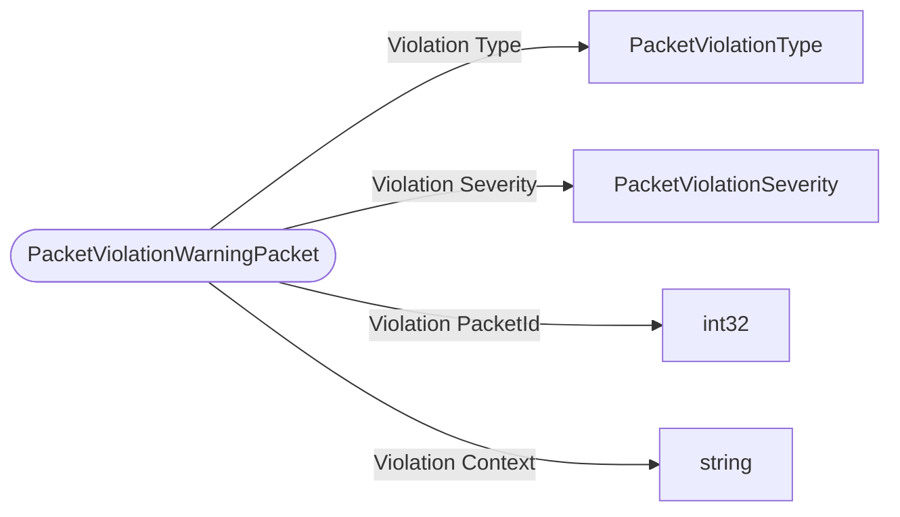

# PacketViolationWarningPacket

`packet` - id **156**

- protocol: 2168
- minecraft: 1.26.40

```mermaid
flowchart LR
  ROOT(["PacketViolationWarningPacket"])
  ROOT -->|"Violation Type"| PacketViolationType["PacketViolationType"]
  ROOT -->|"Violation Severity"| PacketViolationSeverity["PacketViolationSeverity"]
  ROOT -->|"Violation PacketId"| int32["int32"]
  ROOT -->|"Violation Context"| string["string"]
```

