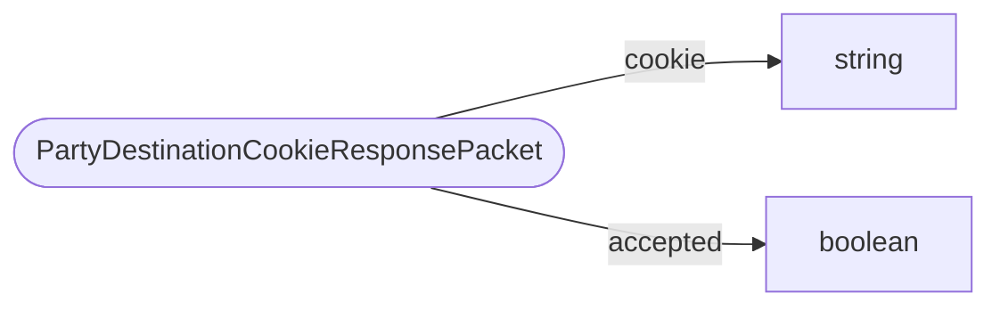

# PartyDestinationCookieResponsePacket

`packet` - id **350**

- protocol: 2168
- minecraft: 1.26.40

```mermaid
flowchart LR
  ROOT(["PartyDestinationCookieResponsePacket"])
  ROOT -->|"cookie"| string["string"]
  ROOT -->|"accepted"| boolean["boolean"]
```

