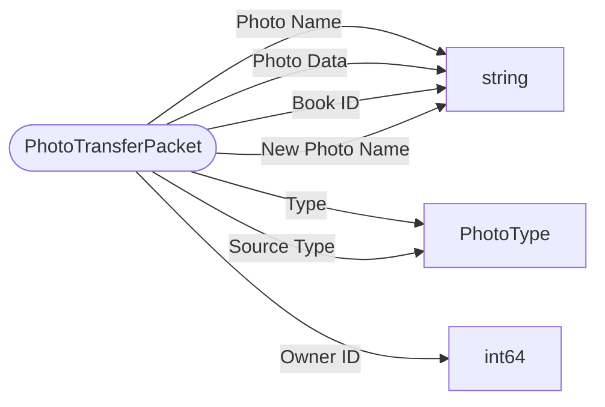

# PhotoTransferPacket

`packet` - id **99**

- protocol: 2168
- minecraft: 1.26.40

	When the player uses the camera item or adds a photo to the scrapbook it sends the photo to the server,
	then the server sends a response back on whether that was successful or not.
	Either uploads a photo to the server's photoStorage or request one from it to be stored in client's photoStorage.
	If no mPhotoData is provided it is a request for the given filename.
	

