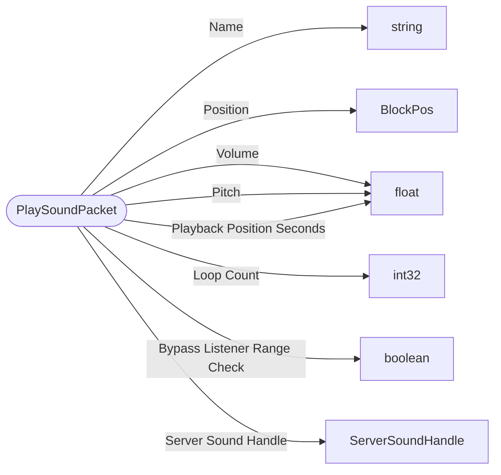

# PlaySoundPacket

`packet` - id **86**

```mermaid
flowchart LR
  ROOT(["PlaySoundPacket"])
  ROOT -->|"Name"| string["string"]
  ROOT -->|"Position"| BlockPos["BlockPos"]
  ROOT -->|"Volume"| float["float"]
  ROOT -->|"Pitch"| float["float"]
  ROOT -->|"Loop Count"| int32["int32"]
  ROOT -->|"Bypass Listener Range Check"| boolean["boolean"]
  ROOT -->|"Server Sound Handle"| ServerSoundHandle["ServerSoundHandle"]
  ROOT -->|"Playback Position Seconds"| float["float"]
```

