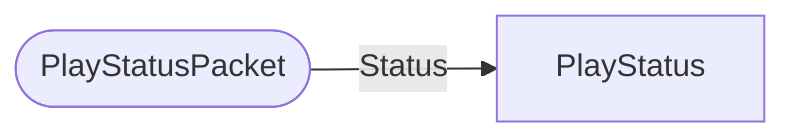

# PlayStatusPacket

`packet` - id **2**

	Used after the Server handles a Login or (Sub)Client Authentication Packet
	If everything is good, then it sends this packet to the client to finish the handshake.
	If everything is not good, it terminates the connection.
	

