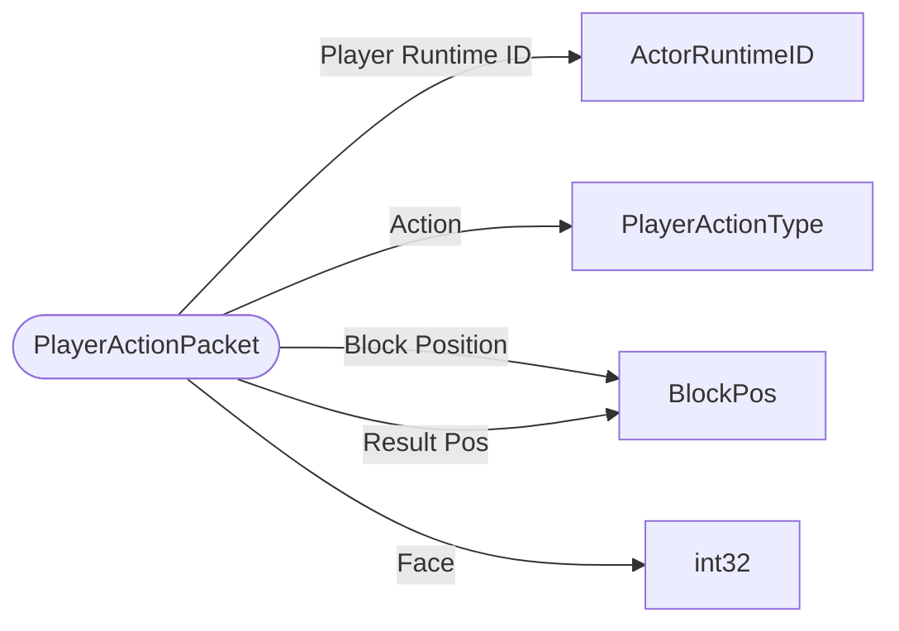

# PlayerActionPacket

`packet` - id **36**

The expected actions change depending on the ServerAuthMovementMode specified in the StartGamePacket.
	See the PlayerActionType enum for details on which have differing behavior.
	See also PlayerAuthInputPacket and InventoryTransactionPacket for similar types of player actions.

