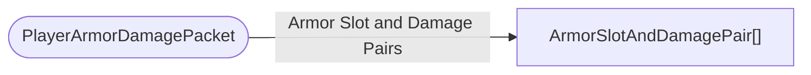

# PlayerArmorDamagePacket

`packet` - id **149**

```mermaid
flowchart LR
  ROOT(["PlayerArmorDamagePacket"])
  ROOT -->|"Armor Slot and Damage Pairs"| ArmorSlotAndDamagePair["ArmorSlotAndDamagePair[]"]
```

