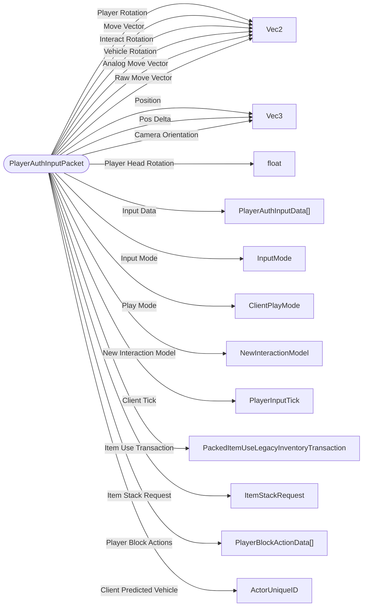

# PlayerAuthInputPacket

`packet` - id **144**

These are for Server Authoritative Movement to sync all player input with the server.

```mermaid
flowchart LR
  ROOT(["PlayerAuthInputPacket"])
  ROOT -->|"Player Rotation"| Vec2["Vec2"]
  ROOT -->|"Position"| Vec3["Vec3"]
  ROOT -->|"Move Vector"| Vec2["Vec2"]
  ROOT -->|"Player Head Rotation"| float["float"]
  ROOT -->|"Input Data"| PlayerAuthInputData["PlayerAuthInputData[]"]
  ROOT -->|"Input Mode"| InputMode["InputMode"]
  ROOT -->|"Play Mode"| ClientPlayMode["ClientPlayMode"]
  ROOT -->|"New Interaction Model"| NewInteractionModel["NewInteractionModel"]
  ROOT -->|"Interact Rotation"| Vec2["Vec2"]
  ROOT -->|"Client Tick"| PlayerInputTick["PlayerInputTick"]
  ROOT -->|"Pos Delta"| Vec3["Vec3"]
  ROOT -->|"Item Use Transaction"| PackedItemUseLegacyInventoryTransaction["PackedItemUseLegacyInventoryTransaction"]
  ROOT -->|"Item Stack Request"| ItemStackRequest["ItemStackRequest"]
  ROOT -->|"Player Block Actions"| PlayerBlockActionData["PlayerBlockActionData[]"]
  ROOT -->|"Vehicle Rotation"| Vec2["Vec2"]
  ROOT -->|"Client Predicted Vehicle"| ActorUniqueID["ActorUniqueID"]
  ROOT -->|"Analog Move Vector"| Vec2["Vec2"]
  ROOT -->|"Camera Orientation"| Vec3["Vec3"]
  ROOT -->|"Raw Move Vector"| Vec2["Vec2"]
```

