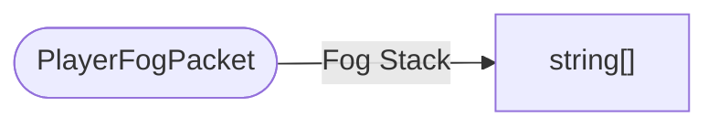

# PlayerFogPacket

`packet` - id **160**

- protocol: 2168
- minecraft: 1.26.40

This is the packet that tracks the active fog stack from the server so the local players can apply different fog settings.

