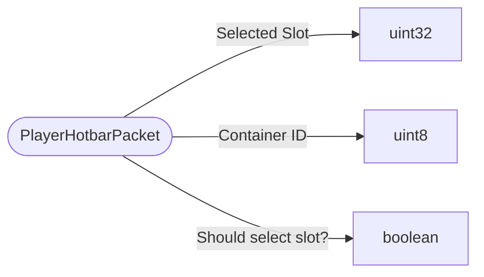

# PlayerHotbarPacket

`packet` - id **48**

```mermaid
flowchart LR
  ROOT(["PlayerHotbarPacket"])
  ROOT -->|"Selected Slot"| uint32["uint32"]
  ROOT -->|"Container ID"| uint8["uint8"]
  ROOT -->|"Should select slot?"| boolean["boolean"]
```

