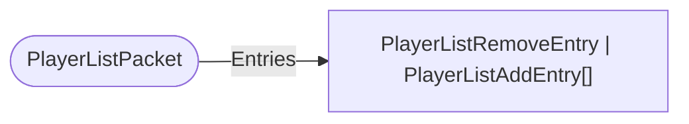

# PlayerListPacket

`packet` - id **63**

Sent from the Server at the start of the game or when a player is added to all clients. Lists the players.

```mermaid
flowchart LR
  ROOT(["PlayerListPacket"])
  ROOT -->|"Entries"| PlayerListRemoveEntry___PlayerListAddEntry["PlayerListRemoveEntry | PlayerListAddEntry[]"]
```

