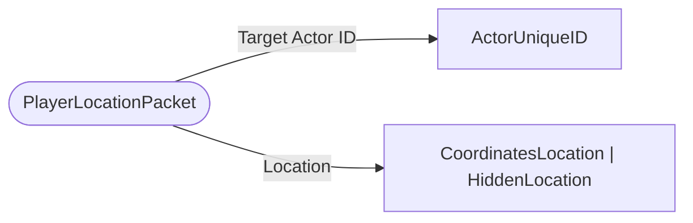

# PlayerLocationPacket

`packet` - id **326**

Sent by PlayerLocationSender when a player position changes beyond a certain angle.

```mermaid
flowchart LR
  ROOT(["PlayerLocationPacket"])
  ROOT -->|"Target Actor ID"| ActorUniqueID["ActorUniqueID"]
  ROOT -->|"Location"| CoordinatesLocation___HiddenLocation["CoordinatesLocation | HiddenLocation"]
```

