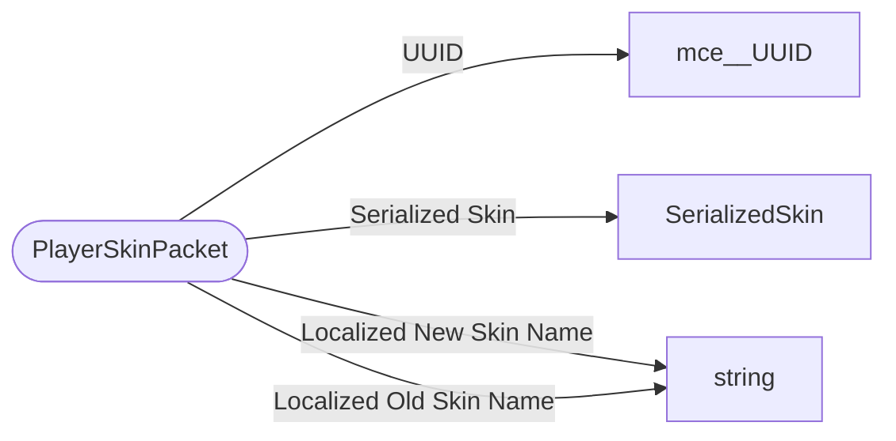

# PlayerSkinPacket

`packet` - id **93**

Sent from the client to server, then processed and broadcasted to all clients. This is used by third-party(3P) servers to send custom geometry.

```mermaid
flowchart LR
  ROOT(["PlayerSkinPacket"])
  ROOT -->|"UUID"| mce__UUID["mce__UUID"]
  ROOT -->|"Serialized Skin"| SerializedSkin["SerializedSkin"]
  ROOT -->|"Localized New Skin Name"| string["string"]
  ROOT -->|"Localized Old Skin Name"| string["string"]
```

