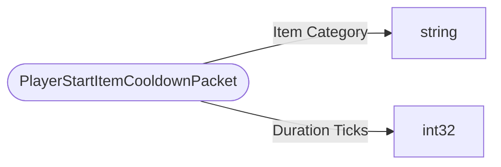

# PlayerStartItemCooldownPacket

`packet` - id **176**

- protocol: 2168
- minecraft: 1.26.40

Packet sent by the player to start the cooldown on an item.

```mermaid
flowchart LR
  ROOT(["PlayerStartItemCooldownPacket"])
  ROOT -->|"Item Category"| string["string"]
  ROOT -->|"Duration Ticks"| int32["int32"]
```

