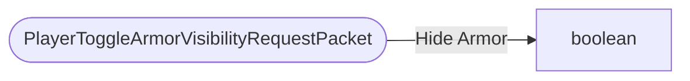

# PlayerToggleArmorVisibilityRequestPacket

`packet` - id **364**

The server derives the player identity from the connection.

```mermaid
flowchart LR
  ROOT(["PlayerToggleArmorVisibilityRequestPacket"])
  ROOT -->|"Hide Armor"| boolean["boolean"]
```

