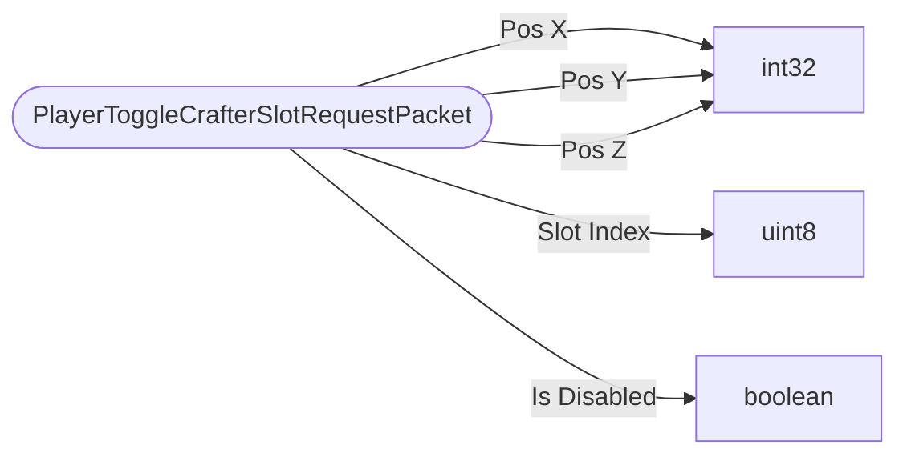

# PlayerToggleCrafterSlotRequestPacket

`packet` - id **306**

```mermaid
flowchart LR
  ROOT(["PlayerToggleCrafterSlotRequestPacket"])
  ROOT -->|"Pos X"| int32["int32"]
  ROOT -->|"Pos Y"| int32["int32"]
  ROOT -->|"Pos Z"| int32["int32"]
  ROOT -->|"Slot Index"| uint8["uint8"]
  ROOT -->|"Is Disabled"| boolean["boolean"]
```

