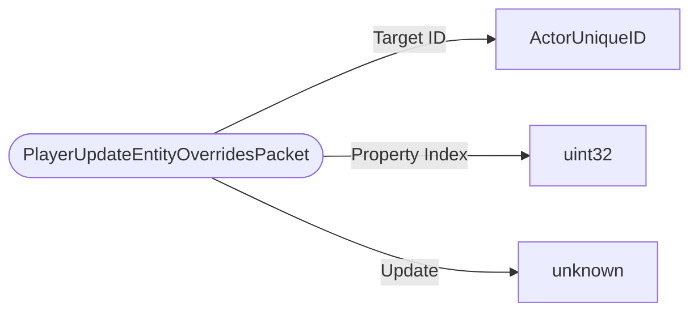

# PlayerUpdateEntityOverridesPacket

`packet` - id **325**

Updates client entity property override data. Sets/removes an override for the indicated property for a specific entity on a client or clears all overrides for that entity.

