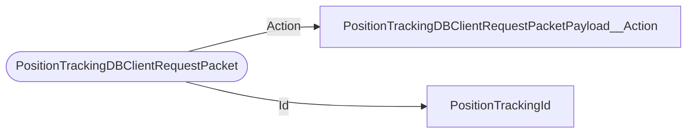

# PositionTrackingDBClientRequestPacket

`packet` - id **154**

- protocol: 2168
- minecraft: 1.26.40

Client to server packet for server authoratative runtime database (with persistent LevelStorage backup) designed primarily to track lodestone stuff. See Position Tracking DB Notes.md in bedrock-docs. see PositionTrackingDBServerBroadcastPacket

