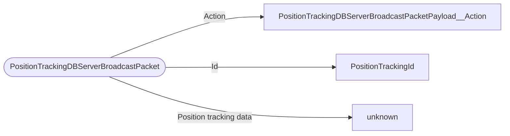

# PositionTrackingDBServerBroadcastPacket

`packet` - id **153**

```mermaid
flowchart LR
  ROOT(["PositionTrackingDBServerBroadcastPacket"])
  ROOT -->|"Action"| PositionTrackingDBServerBroadcastPacketPayload__Action["PositionTrackingDBServerBroadcastPacketPayload__Action"]
  ROOT -->|"Id"| PositionTrackingId["PositionTrackingId"]
  ROOT -->|"Position tracking data"| unknown["unknown"]
```

