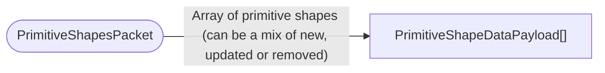

# PrimitiveShapesPacket

`packet` - id **328**

- protocol: 2168
- minecraft: 1.26.40

```mermaid
flowchart LR
  ROOT(["PrimitiveShapesPacket"])
  ROOT -->|"Array of primitive shapes (can be a mix of new, updated or removed)"| PrimitiveShapeDataPayload["PrimitiveShapeDataPayload[]"]
```

