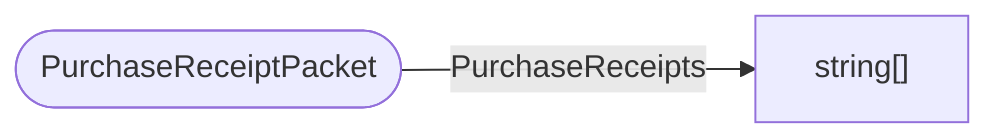

# PurchaseReceiptPacket

`packet` - id **92**

Sent from the client after we make a purchase in the store OR if we login and our entitlements are verified.
It sends a vector of purchase receipts(string).There is a handler and a multiple senders.

