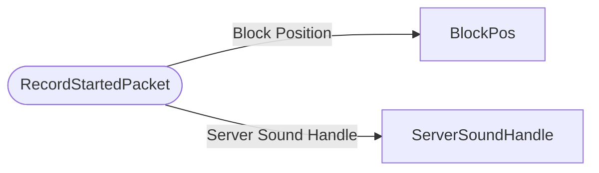

# RecordStartedPacket

`packet` - id **352**

```mermaid
flowchart LR
  ROOT(["RecordStartedPacket"])
  ROOT -->|"Block Position"| BlockPos["BlockPos"]
  ROOT -->|"Server Sound Handle"| ServerSoundHandle["ServerSoundHandle"]
```

