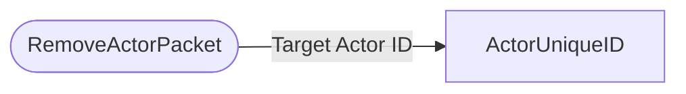

# RemoveActorPacket

`packet` - id **14**

This is sent to the client to confirm which entity is being removed. This is done by sending an ActorUniqueID

```mermaid
flowchart LR
  ROOT(["RemoveActorPacket"])
  ROOT -->|"Target Actor ID"| ActorUniqueID["ActorUniqueID"]
```

