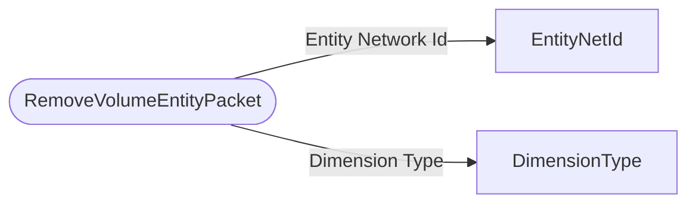

# RemoveVolumeEntityPacket

`packet` - id **167**

```mermaid
flowchart LR
  ROOT(["RemoveVolumeEntityPacket"])
  ROOT -->|"Entity Network Id"| EntityNetId["EntityNetId"]
  ROOT -->|"Dimension Type"| DimensionType["DimensionType"]
```

