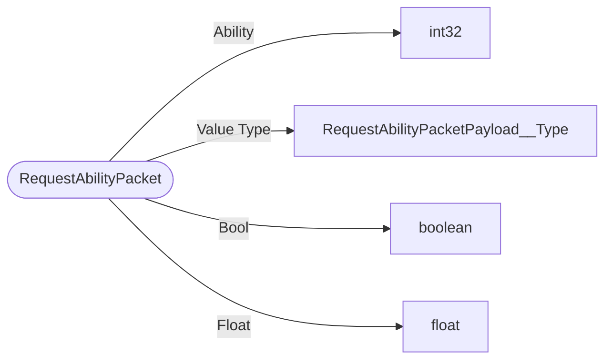

# RequestAbilityPacket

`packet` - id **184**

- protocol: 2168
- minecraft: 1.26.40

Once changed, the server will broadcast the updated state of abilities for that player. If the request is rejected, the caller will receive their reverted state of Abilities.  Can only be used to modify the calling player.  	- mVariable: Info about this variable

