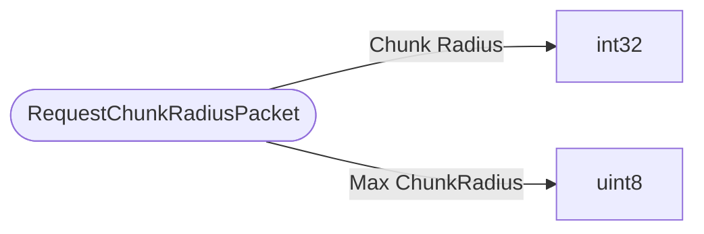

# RequestChunkRadiusPacket

`packet` - id **69**

- protocol: 2168
- minecraft: 1.26.40

This packet is to make sure that the server expands/shrinks first. Additionally for ClientSide Chunk Generation we can send a byte, based on client's hardware capabilities what is the max chunk radius client can handle.

