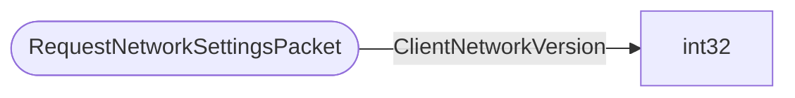

# RequestNetworkSettingsPacket

`packet` - id **193**

- protocol: 2168
- minecraft: 1.26.40

This is the initial packet sent from the client to initiate a connection.  NOTE: this packet should not contain anything other than the client version, don't add new data here.

